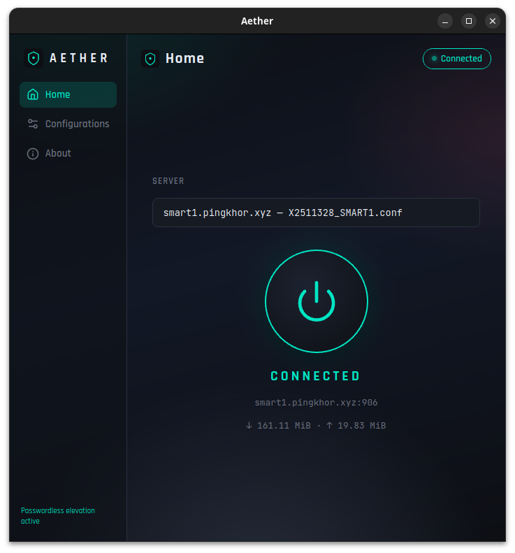
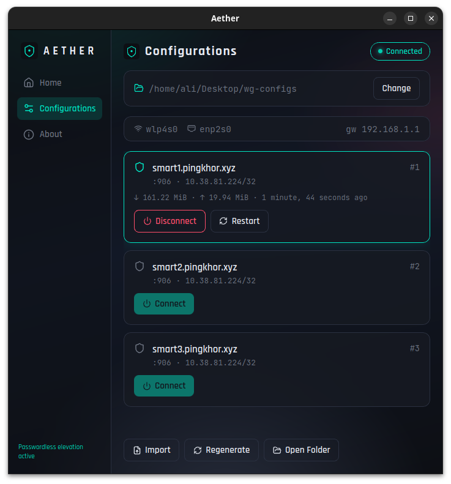

# Aether

[](https://github.com/AliSawari/aether/actions/workflows/build.yml)
[](LICENSE)

**WireGuard, refined.**

A standalone Linux desktop app for managing WireGuard VPN connections. Pick any workspace folder, import provider configs, and connect with one click.

## Screenshots

<p align="center">
  
  &nbsp;&nbsp;
  
</p>

<p align="center">
  <b>Home</b> — one-click connect with live status &nbsp;·&nbsp;
  <b>Configurations</b> — import, regenerate, and manage servers
</p>

## Features

- User-chosen workspace directory (any folder on disk)
- Native Rust config generator (no Node.js required at runtime)
- Auto-detect WiFi/Ethernet and generate split `smart*-wifi` / `smart*-eth` configs
- Home and Config pages with synchronized connection state
- System tray with quick connect/disconnect
- Dark modern UI with live status, transfer stats, and handshake info
- Optional one-time elevation so connect/disconnect skip password prompts

## Install

### From a release (recommended)

Download the latest release for **Linux x86_64**:

| Format | Use case |
|--------|----------|
| `.deb` | Debian/Ubuntu install |
| `.AppImage` | Portable executable, no install |

**Debian / Ubuntu**

```bash
sudo dpkg -i Aether_*.deb
sudo apt-get install -f   # if dependencies are missing
```

**AppImage**

```bash
chmod +x Aether_*.AppImage
./Aether_*.AppImage
```

### Runtime dependencies

- `wireguard-tools` (`wg`, `wg-quick`)
- PolicyKit (`pkexec`) — only until you use **Authorize once**

```bash
sudo apt install wireguard-tools policykit-1
```

## Workspace layout

Pick any folder that contains provider WireGuard `.conf` files directly:

```
/your/workspace/
├── provider-smart1.conf   # provider configs (scanned from this folder only)
├── provider-smart2.conf
├── smart1-wifi.conf       # generated by Aether
├── smart1-eth.conf
└── ...
```

Generated `smart*-wifi.conf` / `smart*-eth.conf` files are ignored when listing servers.

Settings are stored in `~/.config/aether/settings.json`.

## Development

### Prerequisites

- Rust **1.88+** (pinned in `rust-toolchain.toml`)
- Node.js **20+**
- Tauri Linux deps:

```bash
sudo apt install \
  libwebkit2gtk-4.1-dev \
  libayatana-appindicator3-dev \
  librsvg2-dev \
  build-essential
```

### Run locally

```bash
npm install
npm run tauri dev
```

### Production build

```bash
npm run tauri build
```

Bundles are written to `src-tauri/target/release/bundle/` (`.deb`, AppImage, and the standalone binary).

## CI / Releases

| Workflow | Trigger | Output |
|----------|---------|--------|
| [Build](.github/workflows/build.yml) | Push / PR to `master` | `.deb` + AppImage artifacts (90-day retention) |
| [Release](.github/workflows/release.yml) | GitHub Release published | Bundles attached to the release + changelog summary |

**Cut a release**

```bash
git tag v0.1.0
git push origin v0.1.0
```

Create and publish the release on GitHub from that tag. The release workflow builds Linux x86_64 bundles, appends a **What's Changed** section, and uploads the files.

See [CHANGELOG.md](CHANGELOG.md) for version history.

## Optional: passwordless elevation

Aether does not store your sudo password. Use **Authorize once** in the sidebar — this installs a narrow sudoers + PolicyKit rule for Aether's bundled `wgctl.sh` only (one password prompt).

Or manually:

```bash
sudo cp polkit/aether.rules /etc/polkit-1/rules.d/50-aether.rules
```

## Architecture

| Component | Role |
|-----------|------|
| `src-tauri/src/generator.rs` | Regenerates `smart*-wifi/eth.conf` from provider configs |
| `src-tauri/src/wg.rs` | Parses `wg show` output for live status |
| `src-tauri/src/commands.rs` | Tauri commands, elevation, `wgctl` orchestration |
| `scripts/wgctl.sh` | Connect / disconnect / restart (bundled with releases) |
| Svelte frontend | UI, workspace picker, server cards, tray |

## License

MIT © [Ali Sawari](https://github.com/AliSawari). See [LICENSE](LICENSE).

The license is also bundled with installed builds (`LICENSE` in app resources; package metadata on `.deb` / AppImage).

## Author

**Ali Sawari** — [github.com/AliSawari](https://github.com/AliSawari)
